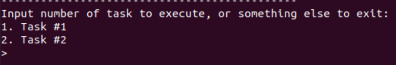
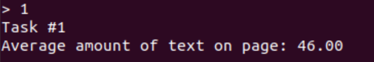
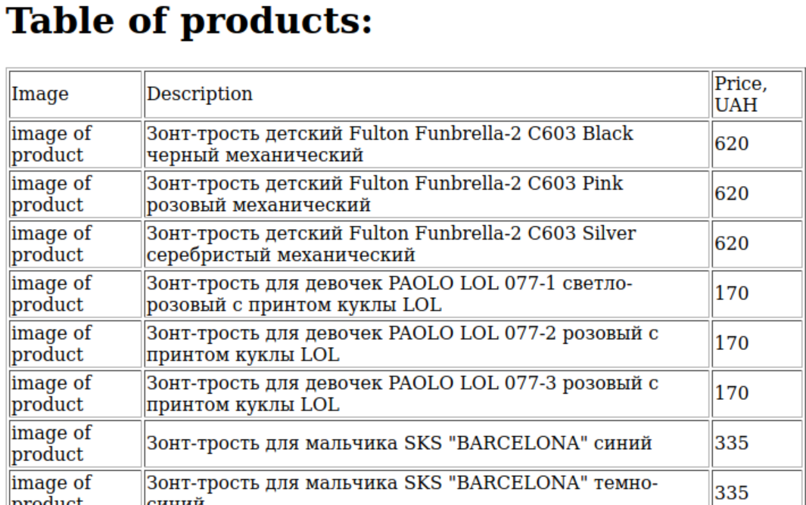
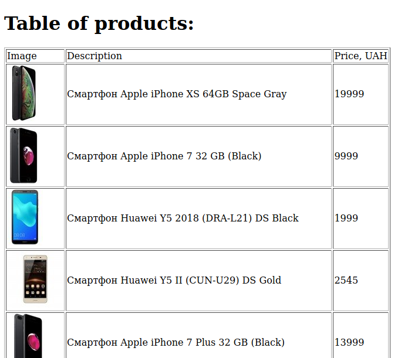

# Лабораторна робота No 1. Вивчення базових операцій обробки XML-документів

## Завдання

[Постановка завдання](docs/lab1_bd2-db2019_2020.docx.pdf)

## Варіант завдання

8 варіант згідно номера у списку групи

| Базова сторінка (завдання 1) | Зміст завдання 2     | Адреса інтернет-магазину (завдання 3) |
|------------------------------|----------------------|---------------------------------------|
| www.golos.ua         | Середня кількість текстових фрагментів | www.wallet.ua |

## Лістинг коду

### Збирання даних зі сторінки www.golos.ua  

`src/scrapers/spiders/golos.py`

```python
class GolosSpider(scrapy.Spider):
    name = 'golos'
    allowed_domains = ['golos.ua']
    start_urls = ['https://golos.ua/']

    def parse(self, response: Response):
        all_images = response.xpath("//img/@src[starts-with(., 'http')]")
        all_text = response.xpath(
            "//*[not(self::script)][not(self::style)][string-length(normalize-space(text())) > 30]/text()")
        yield {
            'url': response.url,
            'payload': [{'type': 'text', 'data': text.get().strip()} for text in all_text] +
                       [{'type': 'image', 'data': image.get()} for image in all_images]
        }
        if response.url == self.start_urls[0]:
            all_links = response.xpath(
                "//a/@href[starts-with(., 'https://golos.ua/')][substring(., string-length() - 4) = '.html']")
            selected_links = [link.get() for link in all_links][:19]
            for link in selected_links:
                yield scrapy.Request(link, self.parse)
```

### Збирання даних зі сторінки www.wallet.ua

`src/scrapers/spiders/moyo.py`

```python
class WalletSpider(scrapy.Spider):
    name = 'wallet'
    allowed_domains = ['www.wallet.ua']
    start_urls = ['https://wallet.ua/c/f-umbrellas-pol_girls-pol_boys/']

    def parse(self, response: Response):
        products = response.xpath("//div[contains(@class, 'prd-wrap')]")[:20]
        print(products)
        for product in products:
            yield {
                'img': 'https://wallet.ua/' + product.xpath(
                    ".//img[contains(@class, 'first-picture')]/@src").get(),
                'price': product.xpath(".//em[contains(@class, 'old crate')]/@data-rate").get(),
                'description': product.xpath(".//a[contains(@class, 'name')]/text()").get()
            }
```

### Запис зібраних даних до файлів

`src/scrapers/pipelines.py`

```python
class ScrapersPipeline(object):
    def __init__(self):
        self.root = None

    def open_spider(self, spider):
        self.root = etree.Element("data" if spider.name == "golos" else "shop")

    def close_spider(self, spider):
        with open('task%d.xml' % (1 if spider.name == "golos" else 2), 'wb') as f:
            f.write(etree.tostring(self.root, encoding="UTF-8", pretty_print=True, xml_declaration=True))

    def process_item(self, item, spider):
        if spider.name == "golos":
            page = etree.Element("page", url=item["url"])
            for payload in item["payload"]:
                fragment = etree.Element("fragment", type=payload["type"])
                fragment.text = payload["data"]
                page.append(fragment)
            self.root.append(page)
        else:
            product = etree.Element("product")
            desc = etree.Element("description")
            desc.text = item["description"]
            pr = etree.Element("price")
            pr.text = item["price"]
            img = etree.Element("image")
            img.text = item["img"]
            product.append(desc)
            product.append(pr)
            product.append(img)
            self.root.append(product)
        return item
```

### Завдання №1

`src/main.py`

```python
def task1():
    print("Task #1")
    root = etree.parse("task1.xml")
    avg = root.xpath("count(//fragment[@type='text']) div count(//page)")
    print("Average amount of text on page: %.2f" % avg)
```

### Завдання №2

`src/main.py`

```python
def task2():
    print("Task #2")
    transform = etree.XSLT(etree.parse("task2.xsl"))
    result = transform(etree.parse("task2.xml"))
    result.write("task2.xhtml", pretty_print=True, encoding="UTF-8")
    print("XHTML page will be opened in web-browser...")
    webbrowser.open('file://' + os.path.realpath("task2.xhtml"))
```

`src/task2.xsl`

```xml
<?xml version="1.0" encoding="UTF-8"?>
<xsl:stylesheet version="1.0" xmlns:xsl="http://www.w3.org/1999/XSL/Transform" xmlns="http://www.w3.org/1999/xhtml">
    <xsl:output
        method="xml"
        doctype-system="http://www.w3.org/TR/xhtml11/DTD/xhtml11.dtd"
        doctype-public="-//W3C//DTD XHTML 1.1//EN"
        indent="yes"
    />
    <xsl:template match="/">
        <html xml:lang="en">
            <head>
                <title>Task 2</title>
            </head>
            <body>
                <h1>Table of products:</h1>
                <xsl:apply-templates select="/shop"/>
                <xsl:if test="count(/shop/product) = 0">
                    <p>There are no products available</p>
                </xsl:if>
            </body>
        </html>
    </xsl:template>
    <xsl:template match="/shop">
        <table border="1">
            <thead>
                <tr>
                    <td>Image</td>
                    <td>Description</td>
                    <td>Price, UAH</td>
                </tr>
            </thead>
            <tbody>
                <xsl:apply-templates select="/shop/product"/>
            </tbody>
        </table>
    </xsl:template>
    <xsl:template match="/shop/product">
        <tr>
            <td>
                 <xsl:apply-templates select="image"/>
            </td>
            <td>
                <xsl:apply-templates select="description"/>
            </td>
            <td>
                <xsl:apply-templates select="price"/>
            </td>
        </tr>
    </xsl:template>
    <xsl:template match="image">
        
            <xsl:attribute name="src">
                <xsl:value-of select="text()"/>
            </xsl:attribute>
        </img>
    </xsl:template>
    <xsl:template match="price">
        <xsl:value-of select="text()"/>
    </xsl:template>
    <xsl:template match="description">
        <xsl:value-of select="text()"/>
    </xsl:template>
</xsl:stylesheet>
```

## Лістинг згенерованих файлів

### task1.xml

```xml
<?xml version='1.0' encoding='UTF-8'?>
<data>
  <page url="https://golos.ua/">
    <fragment type="text">Новости Украины - последние новости дня</fragment>
    <fragment type="text">В Украине отменили самоизоляцию для въезжающих - Минздрав</fragment>
    <fragment type="text">Анонс пресс – конференции: «Смогут ли украинцы получать по две пенсии по смешанной системе?»</fragment>
    <fragment type="text">«Ситуация ухудшается»: Шмыгаль пригрозил снова ввести в Украине жесткий карантин</fragment>
    <fragment type="text">Спасатели предупредили о новой угрозе паводков на Закарпатье</fragment>
    <fragment type="text">Коронавирус в Украине: в Минздраве назвали самый сложный регион</fragment>
    <fragment type="text">Covid-19 в Киеве: число инфицированных превысило 4,6 тысячи</fragment>
    <fragment type="text">В МВД анонсировали увеличение штрафов за превышение скорости</fragment>
    <fragment type="text">Киев сковали огромные пробки: карата проблемных участков</fragment>
    <fragment type="text">Национал-радикалы получили от власти карт-бланш на террор, поджоги и убийства – ОПЗЖ</fragment>
    <fragment type="text">В Украине отменили самоизоляцию для въезжающих - Минздрав</fragment>
    <fragment type="text">В Харькове жестоко избили члена партий: парень в тяжелом состоянии (ФОТО)</fragment>
    <fragment type="text">Кабмин назначил Сергея Шкарлета и.о. министра образования</fragment>
    <fragment type="text">Кендалл Дженнер позировала на кровати в откровенном белье (ФОТО)</fragment>
    <fragment type="text">В Львовской области мужчина избил знакомую до смерти – полиция</fragment>
    <fragment type="text">Левинкова: Если Зеленский и дальше будет копировать Порошенко, рейтинг "слуг народа" потеряет еще больше</fragment>
    <fragment type="text">«МВФ будет против»: как «слуги народа» собрались повышать прожиточный минимум?</fragment>
    <fragment type="text">Почем «дрова»: Ущерб от наводнения в Прикарпатье оценили в 400 миллионов гривен</fragment>
    <fragment type="text">Аваков готов уйти, а Зеленский не хочет отставки главы МВД?</fragment>
    <fragment type="text">Предвыборный карантин: «Окончательно уронит экономику»</fragment>
    <fragment type="text">С. Яременко: «Больших всплесков курса гривны ожидать не стоит»</fragment>
    <fragment type="text">С. Кравченко: «Мы никогда не узнаем достоверных данных о заболеваемости медиков COVID-19»</fragment>
    <fragment type="text">А. Кучеренко: «Трагедия на Позняках произошла из-за того, что жилищный фонд стал неуправляемым»</fragment>
    <fragment type="text">С. Кожушко: «Наемному работнику не стоит бояться отстаивать свои трудовые права в суде»</fragment>
    <fragment type="text">В. Протас: «Маски могут стать источником распространения коронавируса»</fragment>
    <fragment type="text">Пострадавших от взрыва в киевской многоэтажке поселили в дом-интернат</fragment>
    <fragment type="text">В Киеве на Позняках взорвался дом</fragment>
    <fragment type="text">В Харькове состоялся Чемпионат Украины по скалолазанью</fragment>
    <fragment type="text">На Оболонской набережной проходит ремонт</fragment>
    <fragment type="text">В Киеве митинговали за Порошенко</fragment>
    <fragment type="text">Ярослав Рабошук. В проекте укрупнения районов Украины присутствуют политические мотивы</fragment>
    <fragment type="text">Владимир Фундовный: Экономить на учителях неправильно</fragment>
    <fragment type="text">Урожай-2020: будет ли Украина с хлебом, овощами и фруктами после заморозков? (пресс-конференция)</fragment>
    <fragment type="text">«Право на голос»: «К чему приведут массовые беспорядки в США?»</fragment>
    <fragment type="text">Родион Колышко: Сокращение вакансий идет по всем крупным видам экономической деятельности</fragment>
    <fragment type="text">Усиление карантина не сможет отобрать у киевлян лето</fragment>
    <fragment type="text">Правые утратили монополию на «улицу»</fragment>
    <fragment type="text">Откуда деньги: в госбюджет Украины будут собирать средства проверками и штрафами?</fragment>
    <fragment type="text">Коронавирус и путешествия: где отдохнуть украинцам?</fragment>
    <fragment type="text">«Наливайки», рыбалка, метро: Чем порадовало киевлян ослабление карантина</fragment>
    <fragment type="text">Карантин и проблемы в семье: как не огорчать мужа</fragment>
    <fragment type="text">Новый формат политики пройдет верификацию на выборах этой осенью</fragment>
    <fragment type="text">Коронакризис, СНБОУ и частные интересы</fragment>
    <fragment type="text">Требование МВФ: как власти «продали» финансирование производства</fragment>
    <fragment type="text">Пётр Порошенко удачно сходил во власть</fragment>
    <fragment type="text">Рост безработицы и социальные бунты: что ждет Украину?</fragment>
    <fragment type="image">https://golos.ua/assets/img/logo.png?1502208283</fragment>
    <fragment type="image">https://golos.ua/assets/img/logos.png?1514729362</fragment>
    <fragment type="image">https://golos.ua/assets/img/logo.png?1502208283</fragment>
    <fragment type="image">https://golos.ua/assets/img/rec6.jpg?1593086568</fragment>
    <fragment type="image">https://mc.yandex.ru/watch/42475099</fragment>
  </page>
</data>
```

### task2.xml

```xml
<?xml version='1.0' encoding='UTF-8'?>
<shop>
  <product>
    <description>Зонт-трость детский Fulton Funbrella-2 C603 Black черный механический</description>
    <price>620</price>
    <image>https://wallet.ua/</image>
  </product>
  <product>
    <description>Зонт-трость детский Fulton Funbrella-2 C603 Pink розовый механический</description>
    <price>620</price>
    <image>https://wallet.ua/</image>
  </product>
  <product>
    <description>Зонт-трость детский Fulton Funbrella-2 C603 Silver серебристый  механический</description>
    <price>620</price>
    <image>https://wallet.ua/</image>
  </product>
  <product>
    <description>Зонт-трость  для девочек PAOLO LOL 077-1 светло-розовый с принтом куклы LOL</description>
    <price>170</price>
    <image>https://wallet.ua/</image>
  </product>
  <product>
    <description>Зонт-трость  для девочек PAOLO LOL 077-2 розовый с принтом куклы LOL</description>
    <price>170</price>
    <image>https://wallet.ua/</image>
  </product>
  <product>
    <description>Зонт-трость  для девочек PAOLO LOL 077-3 розовый с принтом куклы LOL</description>
    <price>170</price>
    <image>https://wallet.ua/</image>
  </product>
  <product>
    <description>Зонт-трость для мальчика SKS "BARCELONA" синий</description>
    <price>335</price>
    <image>https://wallet.ua/</image>
  </product>
  <product>
    <description>Зонт-трость для мальчика SKS "BARCELONA" темно-синий</description>
    <price>335</price>
    <image>https://wallet.ua/</image>
  </product>
</shop>
```

### task2.xhtml

```xhtml
<!DOCTYPE html PUBLIC "-//W3C//DTD XHTML 1.1//EN" "http://www.w3.org/TR/xhtml11/DTD/xhtml11.dtd">
<html xmlns="http://www.w3.org/1999/xhtml" xml:lang="en">
  <head>
    <title>Task 2</title>
  </head>
  <body>
    <h1>Table of products:</h1>
    <table border="1">
      <thead>
        <tr>
          <td>Image</td>
          <td>Description</td>
          <td>Price, UAH</td>
        </tr>
      </thead>
      <tbody>
        <tr>
          <td>
            
          </td>
          <td>Зонт-трость детский Fulton Funbrella-2 C603 Black черный механический</td>
          <td>620</td>
        </tr>
        <tr>
          <td>
            
          </td>
          <td>Зонт-трость детский Fulton Funbrella-2 C603 Pink розовый механический</td>
          <td>620</td>
        </tr>
        <tr>
          <td>
            
          </td>
          <td>Зонт-трость детский Fulton Funbrella-2 C603 Silver серебристый  механический</td>
          <td>620</td>
        </tr>
        <tr>
          <td>
            
          </td>
          <td>Зонт-трость  для девочек PAOLO LOL 077-1 светло-розовый с принтом куклы LOL</td>
          <td>170</td>
        </tr>
        <tr>
          <td>
            
          </td>
          <td>Зонт-трость  для девочек PAOLO LOL 077-2 розовый с принтом куклы LOL</td>
          <td>170</td>
        </tr>
        <tr>
          <td>
            
          </td>
          <td>Зонт-трость  для девочек PAOLO LOL 077-3 розовый с принтом куклы LOL</td>
          <td>170</td>
        </tr>
        <tr>
          <td>
            
          </td>
          <td>Зонт-трость для мальчика SKS "BARCELONA" синий</td>
          <td>335</td>
        </tr>
        <tr>
          <td>
            
          </td>
          <td>Зонт-трость для мальчика SKS "BARCELONA" темно-синий</td>
          <td>335</td>
        </tr>
      </tbody>
    </table>
  </body>
</html>
```

## Приклади роботи програми








