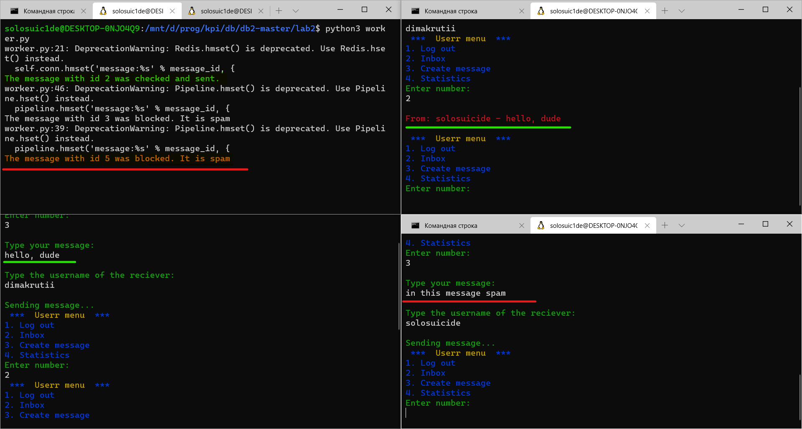
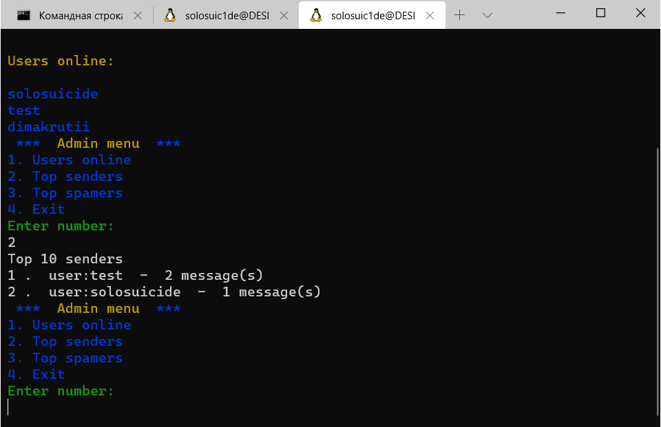
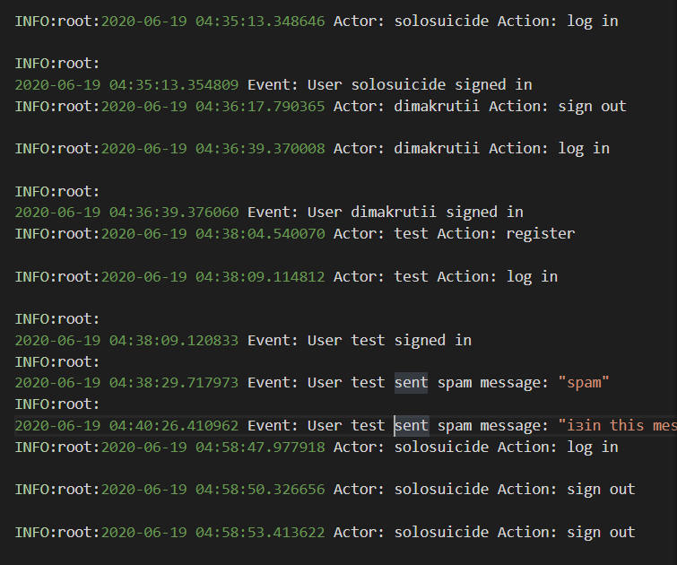

# Лабораторна робота No 2. Практика використання серверу Redis

## Виконавець

Крючек Євгеній Ігорович. Группа КП-71

## Завдання 

[Посилання на завдання](http://scs.kpi.ua/sites/default/files/lab2_bd2-db2019_2020.pdf)

## Структура даних
Для зберігання повідомлень використана хештаблиця, так як вона дозоволяє зберігати ключ та значення. Ключем виступає id повідомлення, значенням - ім'я користувача-відправника, користувача-отримувача, текст повідомлення.

Для зберігання користувачів використана множина (Set), так як нам не є важливий їх порядок, але є важливою швидкість доступу до них.

Для черги повідомлень використувоється List, так як нам є важливий порядок доданих записів, та час додавання та вилучення, який у випадку використання List є константним

## Приклади роботи програми

Приклад відправки та отримання повідомлення

Аккаунт адміністартору

